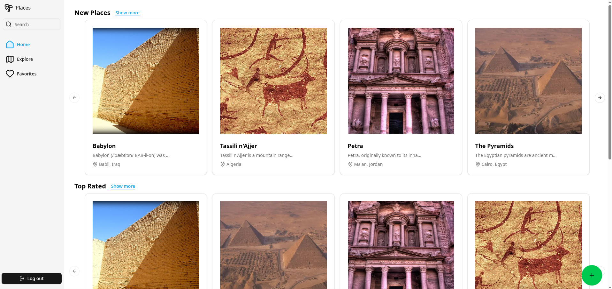
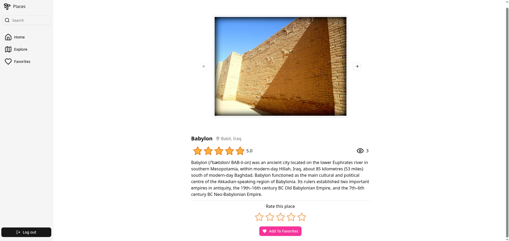
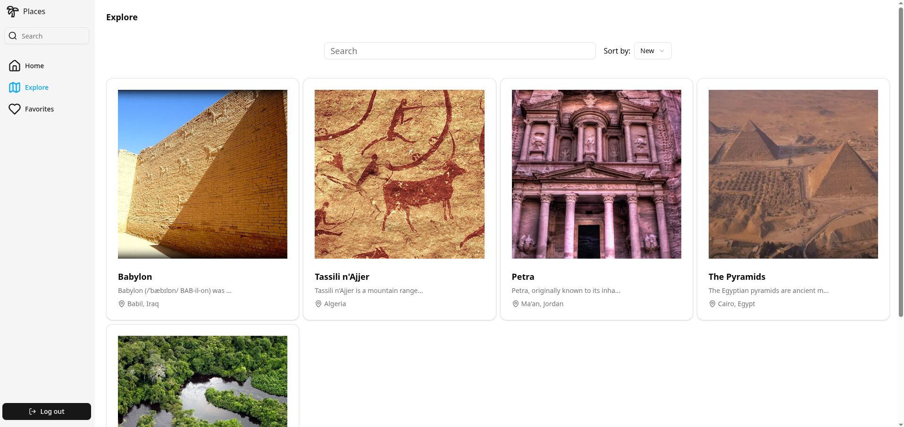

# Places App

Places App is a modern web application where users can discover and share interesting places. Users can add new locations, upload images, write descriptions and rate places they've visited. The app supports real-time updates, secure user ratings, and intelligent sorting of content by popularity, rating, or recency.

## Features

- Add New Places — Title, description, location, and image gallery

- Rating System — One rating per user per place, with average rating calculation

- Popular & Top-Rated Sorting — Sort places by average rating, visit count, or newest

- Authentication — Secure user identification for rating and contributions

- Form Validation — Robust schema validation using Zod + React Hook Form

- State Management — Uses Zustand for scalable global state

## How to run

> [!IMPORTANT]
> This project requires Node.js (v18+), npm and Firebase CLI installed on your system.

To run the project simply type:

    npm run dev

Wait for the Firebase Emulator to start and visit http://localhost:5173

## Tech Stack

- Frontend: React, TypeScript, Tailwind CSS, React Hook Form, Zustand, shadcn & more

- Backend: Firebase Firestore, Firebase Storage, Firebase Cloud Functions

- Validation: Zod

- Routing: React Router

- Icons & UI: Lucide, shadcn/ui, custom components

## Screenshots

--

--

--

--

--

--

--
